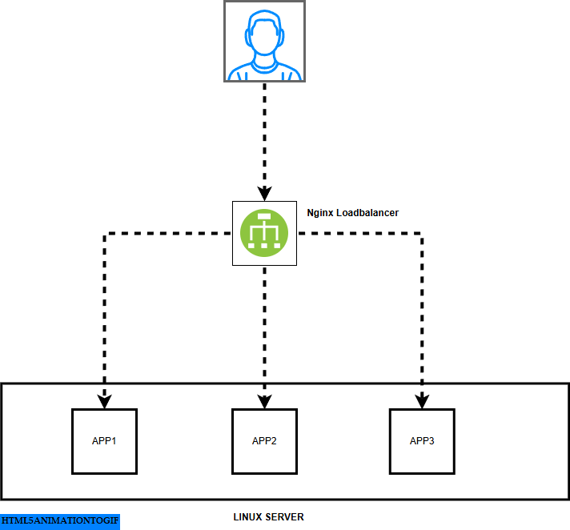

# leaflite

## Version 2

### 🚀 Project Brief: Deploying a Scalable Static Web Application with NGINX Reverse Proxy and Load Balancing

---

### 🎯 Objective

Expand upon the previous project (V1), which involved deploying a simple website using NGINX, by introducing **scalability** and **load balancing**. This version deploys **three instances** of a web application on the server and uses **NGINX** as a **reverse proxy and load balancer**. NGINX directs external traffic to the backend containers, ensuring better performance, fault tolerance, and scalability.

---




### 🧩 Project Scope

#### 1. Web Application Instances
- Deploy **three identical instances** of a static or dynamic web application.
- Each instance runs in its **own Docker container**.

#### 2. NGINX Reverse Proxy & Load Balancer
- Run NGINX either as a **host service** or a **Docker container**.
- Configure NGINX to:
  - Act as a **reverse proxy** for external HTTP requests.
  - **Load balance** incoming traffic across all backend app instances.

#### 3. Networking
- Use **Docker networks** to enable communication between containers.
- Expose the **NGINX service** to handle external traffic from the host.

#### 4. Documentation & Testing
- Document all deployment steps and configurations.
- Demonstrate load balancing via browser or command-line testing (`curl`, etc.).
- Show how traffic is distributed among instances.

---

### 📦 Deliverables

- ✅ Three running instances of the web application in containers.
- ✅ NGINX configured as a reverse proxy and load balancer.
- ✅ Deployment automation via **Docker Compose** or shell scripts.
- ✅ Configuration files:
  - `nginx.conf`
  - `docker-compose.yaml` 
- ✅ README documentation including:
  - Setup steps
  - Load balancing verification procedure

---

### 📚 Requirements

#### 🛠️ Tools & Knowledge
- Docker & Docker Compose
- Basic NGINX reverse proxy/load balancing concepts
- Understanding Docker container networking

#### 💻 Environment
- Linux server or local machine with:
  - Docker installed
  - Docker Compose (if used)
- A text editor (e.g., VS Code)
- Browser or tools like `curl` for testing

---

### 🧪 Development Workflow

1. **Prepare App Container:**
   - Use an existing static site or build your own.
   - Create a `Dockerfile` if needed.

2. **Run App Instances:**
   - Launch **three containers** for the web application.

3. **Configure NGINX:**
   - Define upstream servers in `nginx.conf`.
   - Enable load balancing (e.g., round-robin, least connections). Link to various loadbalancing algorithims could be found [here](https://docs.nginx.com/nginx/admin-guide/load-balancer/http-load-balancer/)


4. **Deploy NGINX:**
   - Run NGINX as a service or container.
   - Ensure it connects to the app containers via Docker network.

5. **Test the Setup:**
   - Access NGINX via a browser or `curl`.
   - Observe load distribution.
   - Test failure recovery by stopping one container.

---

### 🏁 Expected Outcome

By completing this project, you will:

- Deploy multiple containerized web app instances.
- Understand NGINX's role in **reverse proxying** and **load balancing**.
- Gain insights into **horizontal scaling** and **fault-tolerant architecture**.

This is a strong foundation for diving deeper into **microservices**, **container orchestration**, and **cloud-native development**.

---

### 🚀 HOW TO RUN THIS LOCALLY

```bash
docker-compose up --build


> 📌 **Note:** You can find the previous version of this project [here (V1 branch)](https://github.com/isrealei/leaflite/tree/main), which covers single-instance deployment using Docker and NGINX.
